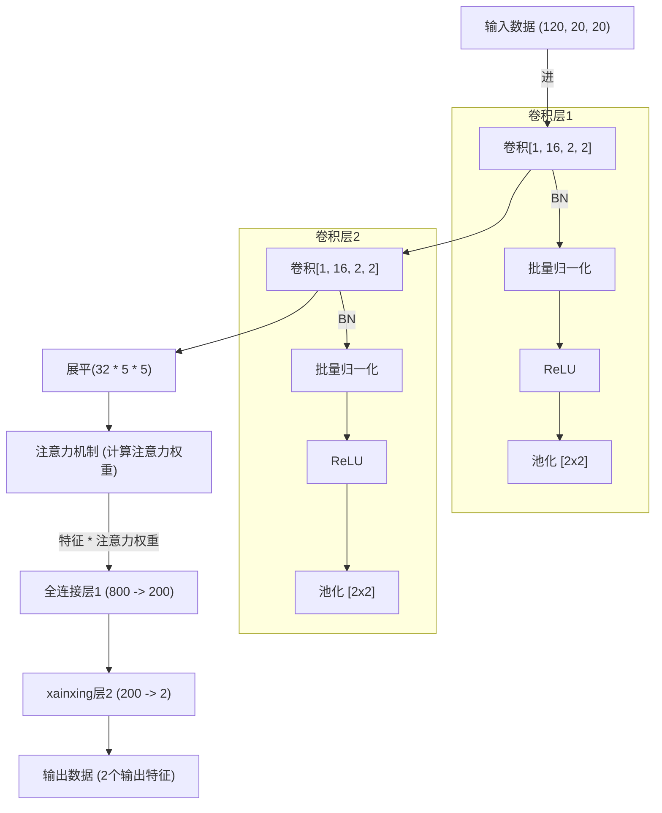

```mermaid
flowchart TD
    A["输入数据 (120, 20, 20)"]
    A -->|进| B["卷积层1 [1, 16, 2, 2]"]
    B --> C{"卷积层2 [16, 32, 2, 2] -> 展平"}
    C -->C4["展平(32 * 5 * 5)"]
    C4["展平(32 * 5 * 5)"] --> G["注意力机制 (计算注意力权重)"]
    G["注意力机制 (计算注意力权重)"] -->|特征 * 注意力权重| D["全连接层1 (800 -> 200)"]
    D --> E["xainxing层2 (200 -> 2)"]
    E --> F["输出数据 (2个输出特征)"]

    subgraph "卷积层1"
    B["卷积[1, 16, 2, 2]"] -->|BN| B1["批量归一化"]
    B1 --> B2["ReLU"]
    B2 --> B3["池化 [2x2]"]
    end

    subgraph "卷积层2"
    C["卷积[1, 16, 2, 2]"] -->|BN| C1["批量归一化"]
    C1 --> C2["ReLU"]
    C2 --> C3["池化 [2x2]"]
    end

  
```