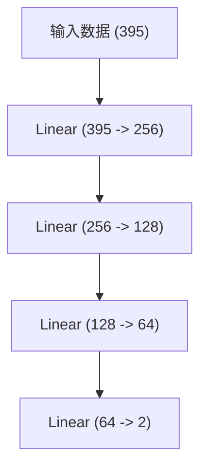

```mermaid
flowchart TD
    A["输入数据 (395)"]
    A --> B["Linear (395 -> 256)"]
    B --> C["Linear (256 -> 128)"]
    C --> D["Linear (128 -> 64)"]
    D --> F["Linear (64 -> 2)"]

    click A "#init" "初始化节点"
    click B "#layer1" "第一层"
    click C "#layer2" "第二层"
    click D "#layer3" "第三层"
    click E "#layer4" "第四层"
    click F "#output" "输出层"
```